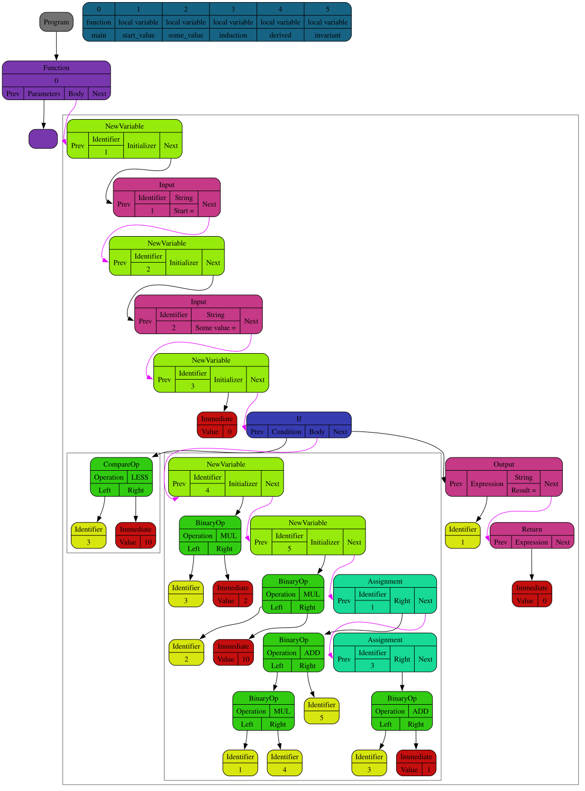
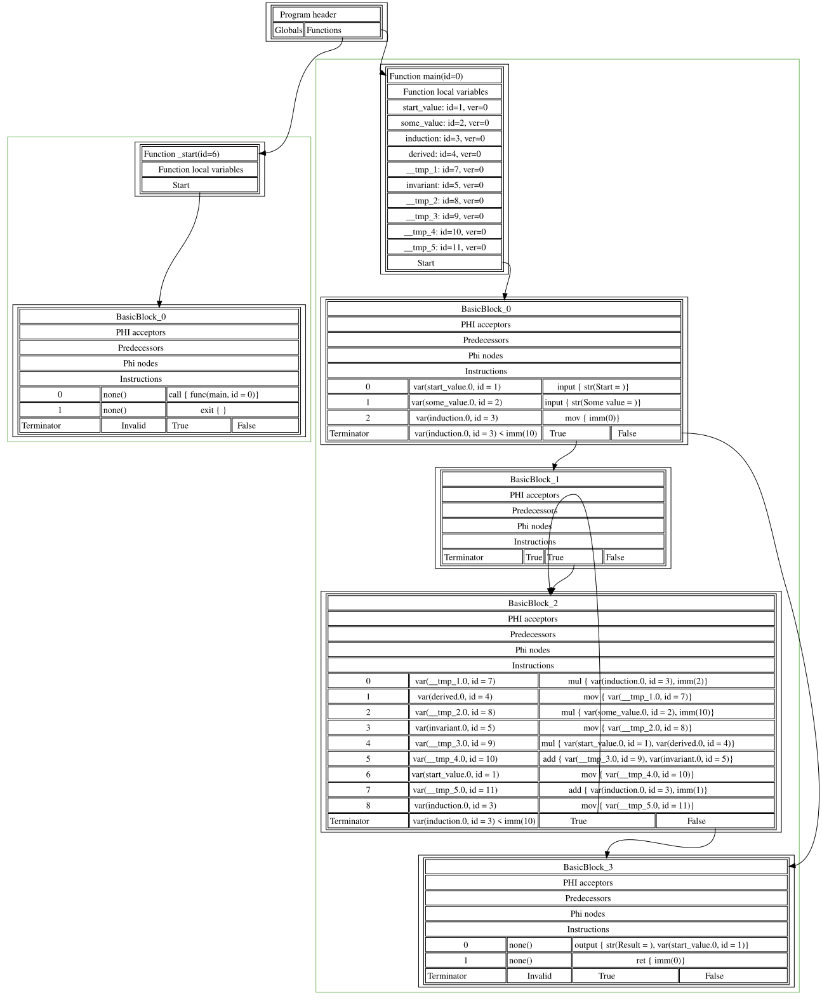
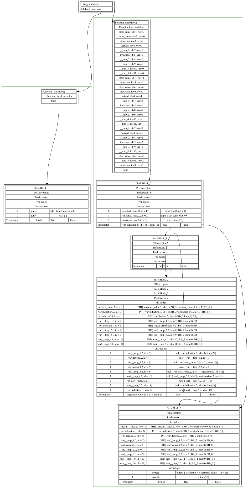
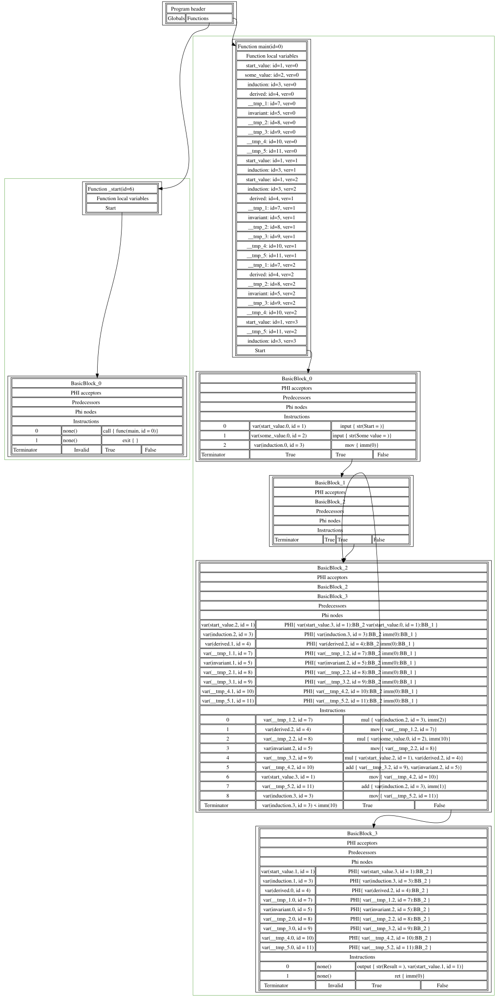
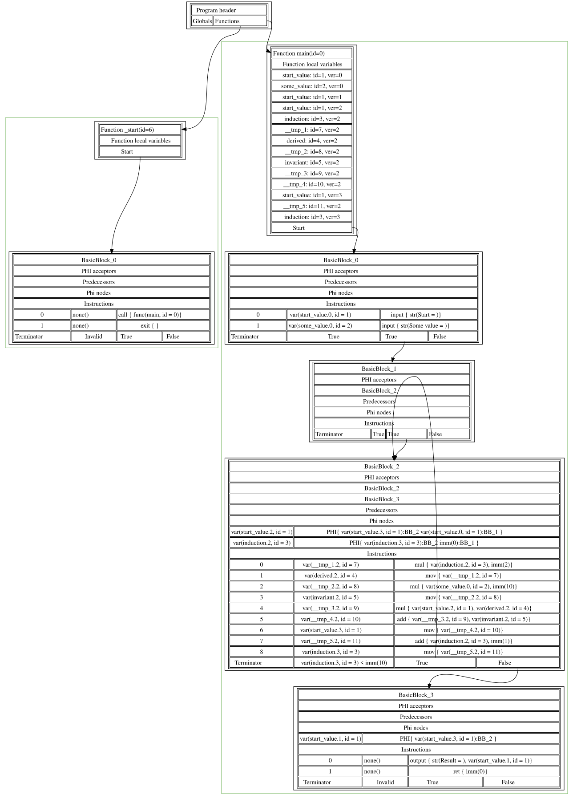
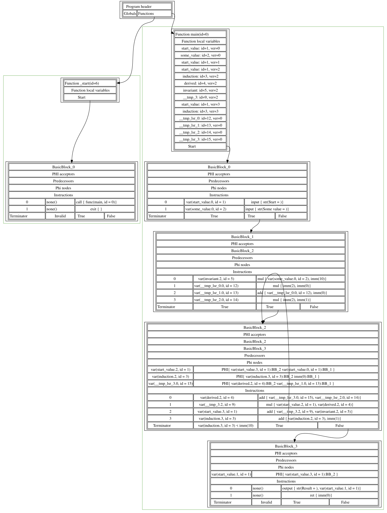
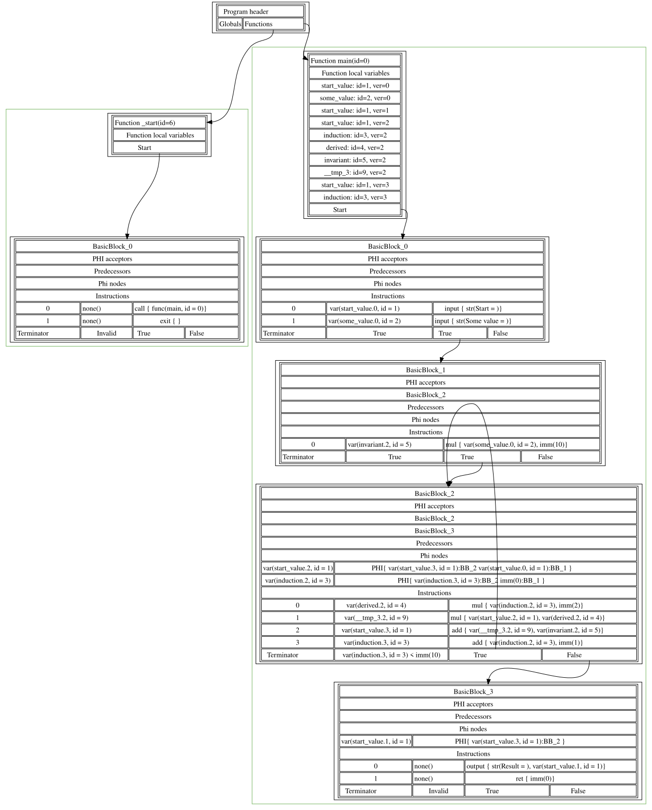
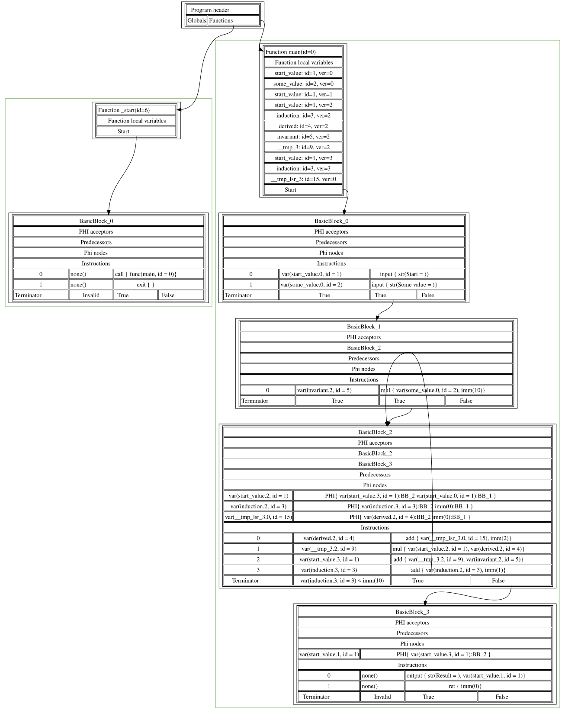

# **D**on't **U**se **M**any **B**rains (DUMB)

## Описание проекта

**Don't Use Many Brains (DUMB)** - это учебный компилятор для простого C-подобного языка
программирования высокого уровня.

## Build & Run
### Сборка проекта выполняется с помощью CMake:
```
cmake -B build
cmake --build build
```
После этого в папке build будет создано 3 исполняемых файла: **dumb**, **dumb_ast_interpreter** и **dumb_ir_interpreter**. Последние два нужны только для отладки самого компилятора. Они представляют из себя интерпретаторы **AST** и **IR** соответствено. **dumb** компилятор, способный преобразовать код на высокоуровневом языке **DUMB** в язык ассемблера.

### Опции компилятора **dumb**
1. **--input** (**--i**) - Файл с исходным кодоб (обязательная опция)

2. **--output** (**-o**) - Выходной файл, в который компилятор запишет код.

3. **--log-flags** (**-lf**) - Флаги для дебажных выводов. Они разделены по категориям:
    - LEXER,
    - PARSER,
    - IR_EMITTER,
    - IR_INTERPRETER,
    - DUMP_AST,
    - DUMP_IR,
    - DOMINATORS_TABLE,
    - BACKEND,
    - SCCP,
    - LOOP_ANALYSIS
Для примера, чтобы включить логи из категорий LEXER и PARSER нужно указать опцию:
```
build/dumb --log-flags LEXER,PARSER ...
```
При включении категорий **DUMB_IR** и **DUMB_AST** в корне репозитория появляются svg изображения с изображенными деревьями и графами соответственно. В консоль пишется информация о том какой граф и куда сохранен. Для того чтобы поменять папку сохранения дампов есть опция **--dump-dir**

4. **--dumb-dir** (**-dd**) - Папка для сохранения дампов графов.

5. **--pipeline** (**-p**) - Указать пайплайн оптимизаций компилятора. Сейчас поддержаны следующие оптимизации: **SCCP**, **DCE**, **LSR**, **ISIM** и **LICM**. Для примера указан дефолтный пайплайн оптимизаций, для которого не нужна эта опция:
```
build/dumb --pipeline sccp-dce-isim-licm-lsr-sccp-dce-isim ...
```
Компилятор запустит оптимизации в указанном порядке.

6. **--benchmark** (**-b**) - Собрать бенчмарк для тестирования времени. В программе исходном коде компилируемой программы должна быть функция  **_test**. Компилятор автоматически вставит в неё цикл с использованием регистров так чтобы общее время работы программы не сильно зависело от самого цикла и чтобы убрать нежелательной оптимизации тестирующего цикла.

7. **--cycles** (**-c**) - Количество повторений цикла, который вставляется в функцию **_test** при сборке с использованием флага **--benchmark**.

### Сборка исполняемого файла:
Для сборки исполняемого файла первым делом надо запустить компилятор. Допустим его выходной файл - *test.s*.
Далее необходимо объектники для стандартной библиотеки и для программы:
```
nasm -f elf64 test.s -o test.o
nasm -f elf64 std.s -o std.o
```
Далее нужно слинковать стандартную библиотеку с программой:
```
ld test.o std.o -o test
```

Получена исполняемая программа: *test*!

## Внутреннее устройство компилятора

Компилятор делится на 3 основные части: **front-end**, **middle-end** и **back-end**.

- В **front-end** происходит преобразование из языка высокого уровня в удобное для дальнейшей работы промежуточное представление.
- В **middle-end** происходят оптимизации над этим промежуточным представлением.
- В **back-end** происходит преобразование программы из промежуточного представления в **x86** ассемблер.

Разберем работу компилятора на примере простейшей программы над которой можно провести достаточно много оптимизаций:
```
function main()
{
    variable start_value;
    input(start_value, "Start = ");
    variable some_value;
    input(some_value, "Some value = ");

    variable induction = 0;
    while ( induction < 10 )
    {
        variable derived = induction * 2;

        variable invariant = some_value * 10;
        start_value = start_value * derived + invariant;
        induction = induction + 1;
    }
    output(start_value, "Result = ");
    return 0;
}
```

### Front-end

Первым этап фронтенда является лексический анализ: исходный код программы разбивается на массив лексем, в которые входят пользовательские строки, специальные символы и ключевые слова, числовые значения и пользовательские строки в ковычках.

Далее с помощью алгоритма рекурсивного спуска из набора лексем строится абстрактное синтаксическое дерево, которое является лишь служебной структурой, позволяющей разделить рекурсивный спуск и генерацию промежуточного представления.

Ниже приведен пример дерева для нашей программы:



Последним этапом фронтенда является построения промежуточного представления (**IR**) из дерева. На рисунке нижу приведен пример построенного (**IR**) для нашей программы:



### Middle-end

Для многих оптимизаций удобно, чтобы присвоение каждой переменной происходило единажды. Это позволяет считать что значение и инструкция это одно и то же. Поэтому первым этапом **middle-end** является построение из обычного промежуточного представления которое отражает наше программу **singe static assignment IR** (**SSA IR**).

#### Построение **SSA IR**

При построении **SSA** возникает проблема с ветвлением: некогда одна переменная теперь представляет из себя сразу две, поэтому нужно как-то определить какую считать действительной. Для решения этой проблемы создаются **PHI**-узлы - узлы которые способны определять, из какого базового блока произошёл переход и какую переменную нужно взять как значение для новой версии данной переменной.

Первым этапом построения **SSA IR** является вставка **PHI**-узлов. Ниже приведен алгоритм вставки на псевдокоде:

```
for each var in func.variables:
    #
    # Находим все блоки в которых определяется переменная
    #
    def_blocks = definition_blocks(var)

    while def_blocks not empty:
        block = def_blocks.pop()

        #
        # Далее нужно итерироваться по всем блокам в фронте доминирования данного блока.
        # Фронт доминирования для блока B_n - множество всех блоков B_m, таких что:
        # B_n доминирует хотя бы одного из предков B_m и B_n не является строгим доминатором B_m.
        # Фактически фронт доминирования - узлы схождения управления, в которых может случиться
        # ситуация, что нужно выбирать, какая переменная должна быть в текущем состоянии программы.
        #
        for each toe_control_block in dominance_frontier(block):
            #
            # Просто добавляем пустой PHI-узел
            #
            toe_control_block.add_phi(var)

            #
            # Добавилось новое определение - сам PHI-узел, следовательно нужно добавить
            # блок куда вставляем в стэк блоков с определениями
            #
            if toe_control_block not in def_blocks:
                def_blocks.push(toe_control_block)
```

Следующим этапом построения **SSA IR** является переименование переменных. Ниже приведен использованный алгоритм на псевдокоде (в компиляторе он реализован нерекурсивным, но это делается простой симуляцией стека):

```
#
# Счетчик количества созданных версий для variable
#
counters[variable]

#
# Стек активных версий для variable
#
stack[variable]

#
# Процедура переименования, вызывается для entry блока функции.
#
rename(block):
    #
    # Проходимся по всем инструкциям
    #
    for each instruction and phi:
        #
        # Для того что определеят инструкция добавляем новую версию и увеличиваем счетчик.
        #
        definition = (instruction or phi).defines
        stack[definition].push(counters[definition])
        counters[definition]++

        #
        # Для всего что использует инструкция устанавливаем версию в последнюю в стеке.
        #
        for each variable operand of instruction or phi:
            operand = (id=operand.id, version=stack[operand])

    #
    # То же самое что и с операндами инструкций (терминатор по факту такая же инструкция, только ничего не определяет)
    #
    for each variable operand of terminator:
        operand = (id=operand.id, version=stack[operand])

    #
    # Переименуем переменные во всех блоках куда можно попасть из текущего блока.
    #
    for successor of block:
        rename(successor)

    #
    # Откатываем изменения стека (возвращаемся к ранее определенной версии)
    #
    for each instruction and phi:
        definition = (instruction or phi).defines
        stack[defines].pop()
```

После этого **IR**, сгенерированный **front-end**-ом становится **single static assignment**. Ниже приведен пример построенного **SSA IR** для нашей программы:



Как видно на изображении, в текущем виде **SSA IR** очень сложный, в нем возникло достаточно много лишних **PHI**-узлов, но как это часто бывает в компиляторах, с этим будут разбираться дальнейшие оптимизации.

#### Оптимизация **Sparce Conditional Constant Propagation**

Для реализации этой оптимизации используется алгоритм ниже:
```
#
# Рабочие списки: изменения чего-то в терминаторах блоков добавляет возможность для дальшейшего изменения в successor-ах
# текущего блока, а изменение чего-то для переменной позволяет проводить дальнейшие оптимизации для зависимых от нее переменных,
# поэтому в этом алгоритме используется два рабочих списка.
#
cfg_worklist
ssa_worklist

#
# Для каждой переменной возможно 3 значения: undefined (когда переменная еще не определена),
# overdefined (когда по промежуточному представлению нельзя восстановить значение переменной)
# и constant (когда точно известно чему равна переменная)
#
value_map

cfg_worklist.push(entry)

while cfg_worklist or ssa_worklist not empty:

    for each block in cfg_worklist:
        for each instruction or phi:
            #
            defintion = instruction.defines

            #
            # Эта оптимизация вычисляет условные переходы и математические опрации: var.version = OPERAND_1 OP OPERAND_2
            #
            if value_map[OPERAND_1] is constant and value_map[OPERAND_2] is constant:
                if constants are same:
                    value_map[definition] = constant (first_value OP second_value)
                else:
                    value_map[definition] = overdefined
            else if value_map[OPERAND_1] is overdefined or value_map[OPERAND_2] is overdefined:
                value_map[definition] = overdefined

            if value_map changed for definition:
                ssa_worklist.push(definition)

    for each variable in ssa_worklist:
        for each use of variable in instruction or phi:
            # Такие же вычисления как для блоков
        for each use of variable in terminator:
            #
            # Пробуем вычислить терминатор и если в зависимости от результата добавляем
            # succossor-ов блока в cfg_worklist
            #
            result = try_to_evaluete_terminator()
            if result is undefined:
                cfg_worklist.push(true_dest)
                cfg_worklist.push(false_dest)
            if result is True:
                cfg_worklist.push(true_dest)
            if result is False:
                cfg_worklist.push(false_dest)

```

После оптимизации **IR** нашей программы выглядит так:


Как видно, **SCCP** позволил протащить константу в первое условие цикла и убрать один условный переход. Также **SCCP** позволил протащить много констант для **PHI**-узлов, что в дальнейшем позволит **DCE** удалить много ненужного кода.

#### Оптимизация **Dead Code Elimination**

Для оптимизации **DCE**, которая удаляет не используемый код используется алгоритм приведенный ниже:

```
#
# Устанавливаем для каждой переменной счетчик в количество ее использований
#
counters = count_uses()

changed = true
while changed:
    changed = false

    #
    # Удаляем все переменные у которых нет использований:
    #
    for each variable with counters[variable] = 0:
        instruction = find_definition(variable)
        #
        # Удаляем только если инструкция не имеет сайд эффектов, например операция ввода вывода не может быть удалена,
        # даже если она не влияет на работу программы
        #
        if instruction does not have side effects:
            #
            # Уменьшаем счетчики для всех используемых в определении переменных
            #
            for each operand of instruction:
                counters[operand]--;

            #
            # Удаляем определение
            #
            remove_instruction(instruction)

            changed = true

```

В будущем стоит заменить этот алгоритм на более совершенный: в текущей реализации алгоритм не учитывает возможные разорванные циклы в **SSA**-графе. **SSA**-граф - это граф зависимостей между переменными. Например в ситуации когда есть цикл в котором ничего не зависит от индуктивности, его можно было бы выбросить, но появляется проблема того что все 3 переменные индуктивности зависят друг от друга:
```
BB_0:
i.0 = 0
BB_1:
i.1 = PHI(BB_0:i.0, BB_1:i.2)
i.2 = i.1 + 1
if (cond) goto BB_1
```

После проведения оптимизации наш **IR** выглядит так:


На картинке можно заметить, что **DCE** смог убрать достаточно много ненужных вычислений **PHI**-узлов. В более синтетических примерах можно добиться удаления больших кусков кода, которые приводили бы к замедлению работы программы. В реальности **DCE** очень полезен для применения после следующей оптимизации - **Loop Strength Reduction**, поскольку она генерирует достаточно много вычислений в прехедере циклов, которые могут не использоваться.

#### Оптимизация **Loop Strength Reduction**

Для оптимизаций над циклами нужно реализовать достаточно большой блок с анализом циклов: поиск циклов в графе, поиск базовых индуктивностей, поиск зависимых индуктивностей.
В этом компиляторе реализуются оптимизации только над каноническими циклами (только они возможны благодаря ограничениям **front-end**-а).

Канонический цикл представляет из себя обратную дугу (то есть такую дугу B->A, что A доминирует B) и все блоки из которых достижима вершина B, если из графа удалить вершину A и все её рёбра. Для поиска канонических циклов в компиляторе просто происходит перебор всех возможных дуг.

Базовой индуктивностью называется переменная которая встречается в цикле, изменяется только один раз и на константу. Сами по себе базовые индуктивности не так интересны, более интересны зависимые индуктивности. В текущей реализации компилятор способен находить зависимые индуктивности вида x = CONST * i + CONST, которые позволяют перейти к новой индуктивной переменной и избавиться от дорогостоящего умножения внутри цикла. В будущем планируется добавить возможность находить зависимые переменные вида x = INV * i + INV, где INV - это инвариант относительно цикла, а также переменные с более сложной линейной зависимостью.

Поиск базовых индуктивностей тривиален, он сводится к перебору **PHI**-узов и поиску сложения с результатом **PHI**-узла. Поиск зависимых индуктивностей ещё более тривиален, он сводится к перебору инструкций и проверке, что инструкция является умножением или сложением.

Ниже приведен пример **IR** после оптимизации **LSR**:


В стандартном пайплайне компилятора **LSR** запускается после **Instruction Simplification**. Одним из последствий этого является то что внутри цикла убрались лишнии копирования с помощью **MOV**. Однако можно заметить различия, которые внёс именно **LSR**: умножение (достаточно дорогая операция) внутри цикла было вынесено в **Preheader**, а в самом цикле осталось только сложение.
Также можно заметить, что **LSR** создал много мусорных вычислений, которые можно было бы упростить или удалить. Эта проблема устраняется с помощью **SCCP** и **DCE** на следующих иттерациях.

#### Оптимизация **Loop Invariant Code Motion**

Суть оптимизации заключается в вынесении в **Preheader** цикла инвариантных вычислений. Благодаря тому что все циклы в программе являются каноническими, у них всегда есть **Preheader**, который исполняется только один раз и только в случае если цикл исполнится хотя бы один раз (так как каноничный цикл это do-while, обойденный if-ом).



#### Оптимизация **Instruction Simplification**

Также в компиляторе реализована простейшее упрощение инструкций, которое позволяет заменить сложение с нулём на обычное копирование и умножение на 0 на обычное присвоение 0.
В этой оптимизации убираются ненужные копирования, которые часто являются результатом работы **front-end**.

#### Итог оптимизации

Ниже приведена картинка. Её можно сравнить с начальным **IR**.



Как видно по итогу удалось продвинуть достаточно много констант, убрать один условный переход, вынести из цикла инвариант с достаточно сложным вычислением - умножением, а также заменить одно умножение в цикле на сложение.

Ниже приведена таблица результатов для тестов из папки **benchmark/**. Они достаточно синтетические, но всё же показывают реальные способности компилятора, который позволяет программисту писать читаемый и удобный код.

| Test | dce | default-pipeline | licm | lsr | none | sccp |
|---|---|---|---|---|---|---|
| ConstantFakeFlowControl |  67.0% |  44.7% |  101.0% |  100.7% |  100.0% |  57.2% |
| DeadCalculations |  13.7% |  7.5% |  102.2% |  100.4% |  100.0% |  101.3% |
| EmptyCalculations |  103.5% |  24.1% |  102.7% |  103.8% |  100.0% |  67.9% |
| FibonacciRecursiveMultiple |  100.6% |  102.1% |  100.1% |  100.5% |  100.0% |  100.3% |
| LicmBenchmark |  59.9% |  45.9% |  66.1% |  99.3% |  100.0% |  96.8% |
| LsrBenchmark |  80.2% |  56.8% |  100.3% |  100.7% |  100.0% |  98.8% |

### Back-end

Этот модуль позволяет генерировать ассемблер (или в будущем исполняемый ELF - файл). В нем происходит управление
стеком вызовов.

#### План работ по **back-end** на будущее
- Добавить **Register Allocation**
- Добавить бинарную трансляцию

## Описание языка

Язык **DUMB** - простейший C-подобный язык без типизации. В языке поддержаны локальные и глобальные переменные, циклы, функций, условия. Есть возможность рекурсии. Для понимания синтаксиса языка рекомендуется посмотреть на содержимое папок **tests/** и **benchmarks/**
